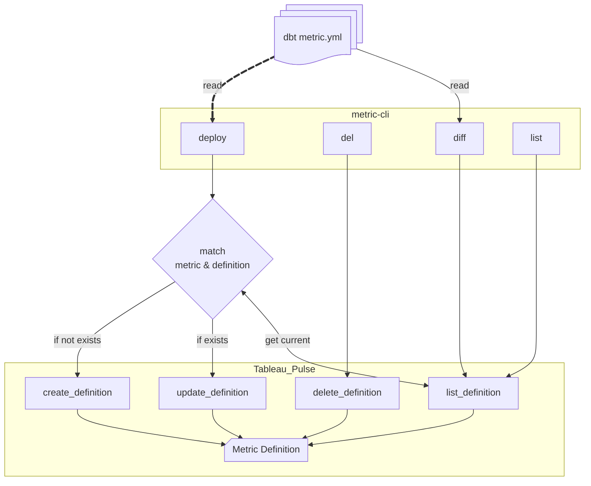
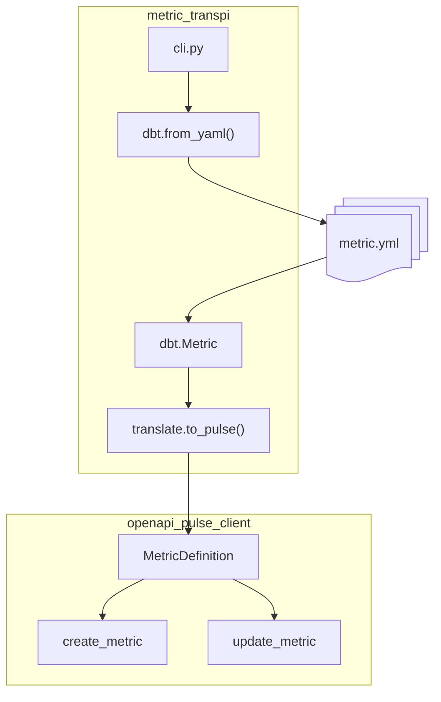

## How does it work ?

### 1. Functional : deploy metrics to Tableau Pulse

### 2. Technical design : convert dbt metrics (YAML) into Pulse MetricDefinition

##### Futur improvement

The format of a metric could be adapted to any metric input format, for example LookML or CubeJS